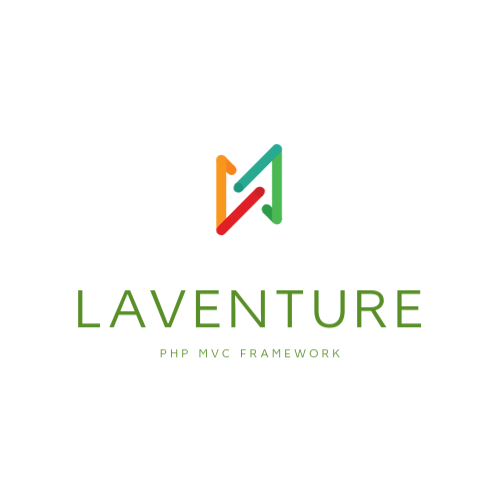

<p align="center">
<a href="#" target="_blank">
 
</a>
</p>


<p align="center">
<a href="https://packagist.org/packages/laventure/framework"></a>
<a href="https://packagist.org/packages/laventure/framework"></a>
<a href="https://packagist.org/packages/laventure/framework"></a>
</p>

## Laventure
Laventure is a web application framework using architecture mvc with simple implementation.


### The framework is not completed for production. But now in development process
```composer require laventure/framework:dev-master```

**Related core package**: https://github.com/jeandev84/laventure-framework


### Installation

1. Clone repository
```
 $ git clone https://github.com/jeandev84/laventure.git
```

2. Install laventure framework package and dependencies
```
 $ composer install
```

3. Create and copy environment file `.env` form `.env.example`:
```
 $ cp .env.example .env [linux]
```

4. Configure your `.env` file like it :
- Configuration application
- Connection to mysql|postgres|sqlite database
```
### APPLICATION ###

APP_NAME=YOUR_PROJECT_NAME
APP_ENV=dev
APP_URL=YOUR_BASE_URL
APP_SECRET=YOUR_SECRET_KEY (can be changed via command)
APP_DEBUG=true


### DATABASE ###

DB_TYPE=pgsql
DB_HOST=127.0.0.1
DB_NAME=laventure
DB_USER=postgres
DB_PASS=123456
DB_PORT=5432
```

6. Create a database via laventure console application
* ( we'll be created name of database from .env example: laventure )
```
 $ php console database:create 
```

5. You can run migrations if exists :
```
 $ php console migration:migrate
```

6. Run local server http://127.0.0.1:8000:
```
 $ php console server:run
 
 Server Listen on the port :8000
 Open to your browser next link http://localhost:8000
```

### Installation via Docker
```
in process
```


### Documentation
- [Components](https://github.com/jeandev84/laventure-framework/tree/master/docs/components/list.md)
- [Foundation](https://github.com/jeandev84/laventure-framework/tree/master/docs/foundation/list.md)
- [Express](https://github.com/jeandev84/laventure-framework/tree/master/docs/express/list.md)